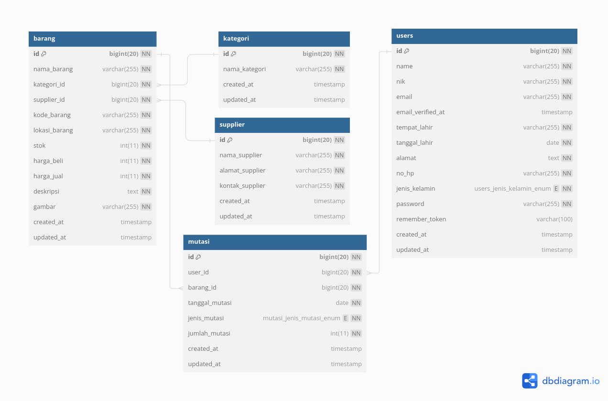

# Sistem Gudang

Sistem Gudang adalah aplikasi berbasis web yang dirancang untuk mengelola dan mengontrol stok barang di sebuah gudang. Aplikasi ini dirancang dengan menggunakan Laravel untuk backend dan Docker untuk manajemen dan deployment kontainer.

## Daftar Isi

- [Sistem Gudang](#sistem-gudang)
  - [Daftar Isi](#daftar-isi)
  - [Persyaratan Sistem](#persyaratan-sistem)
  - [Instalasi](#instalasi)
  - [Daftar Username dan Password](#daftar-username-password)
  - [Teknologi](#teknologi)
  - [Author](#author)

## Persyaratan Sistem

- PHP 8.1 - 8.3.
- MySQL atau database relasional lainnya (XAMPP/LAMPP).
- Postman
- Composer

## Instalasi

Membuka terminal lalu
Clone repositori ini ke dalam direktori komputer anda

- `cd Sistem_Gudang`
- `composer install atau composer update` 
- `cp .env.example .env`
- `php artisan key:generate`
- silahkan membuat database dengan contoh : 
   
  
   
- `php artisan migrate --seed`
- `php artisan serve`

## Daftar Username-Password

| Email             | Password    |
| ----------------- | ----------- |
| admin@mail.com    | password    | 
| firgi@mail.com    | password    |

## Teknologi
- Framework: Laravel
- Versi Laravel: 10.0
- Dokumentasi Laravel: https://laravel.com/docs/10.x
- Database: MySQL
- Autentikasi: Laravel Sanctum atau Passport untuk manajemen token
- Containerization: Docker untuk build, deployment, dan pengelolaan lingkungan aplikasi

pastikan sudah menjalankan backend
- Api Postman dapat dilihat pada link berikut : <a href="https://documenter.getpostman.com/view/23730561/2sA3sAfmwE">Sistem Gudang Api Dokumentasi</a>
- Struktur Data Konsep  
  
  

## Author

Firgi Sotya Izzuddin | 2024
