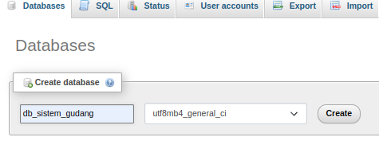

# Sistem Gudang

Sistem Gudang adalah aplikasi berbasis web yang dirancang untuk mengelola dan mengontrol stok barang di sebuah gudang. Aplikasi ini dirancang dengan menggunakan Laravel untuk backend dan Docker untuk manajemen dan deployment kontainer.

## Daftar Isi

- [Sistem Gudang](#sistem-gudang)
  - [Daftar Isi](#daftar-isi)
  - [Persyaratan Sistem](#persyaratan-sistem)
  - [Instalasi](#instalasi)
  - [Penggunaan](#penggunaan)
  - [Daftar Username dan Password](#daftar-username-password)
  - [Teknologi](#teknologi)
  - [Author](#author)

## Persyaratan Sistem

- PHP 8.1 - 8.3.
- MySQL atau database relasional lainnya (XAMPP/LAMPP).
- Web server (contoh: Apache).
- Browser web modern (Chrome/Firefox).
- Composer

## Instalasi

Membuka terminal lalu
Clone repositori ini ke dalam direktori komputer anda

- `cd Sistem_Gudang`
- `composer install atau composer update` 
- `cp .env.example .env`
- `php artisan key:generate`
- silahkan membuat database dengan contoh : 
 
  
- `php artisan migrate --seed`
- `php artisan serve`

## Penggunaan

1. Buka Postman
2. Masuk Menu Collection dan import file Collection berikut : 

## Daftar Username-Password

| Email             | Password    | Role      |
| ----------------- | ----------- | --------- |
| admin@gmail.com   | password    | Admin     |
| leader@gmail.com  | password    | Leader    |
| spv@gmail.com     | password    | SPV       |
| dhead@gmail.com   | password    | Dept Head |

## Framework

Aplikasi ini menggunakan kombinasi Laravel sebagai backend dan Angular sebagai frontend untuk memastikan kehandalan, keamanan, dan antarmuka pengguna yang responsif.

### Backend (Laravel)
- Framework: Laravel
- Versi Laravel: 8.0
- Dokumentasi Laravel: https://laravel.com/docs/8.x
### Frontend (Angular)
- Framework: Angular
- Versi Angular: 16
- Dokumentasi Angular: https://angular.io/docs

pastikan sudah menjalankan backend
- Api Postman dapat dilihat pada folder /doc/postman/*
- User Case Diagram  
  
- Struktur Data Konsep  
  
  

## Author

Firgi Sotya Izzuddin | 2024
